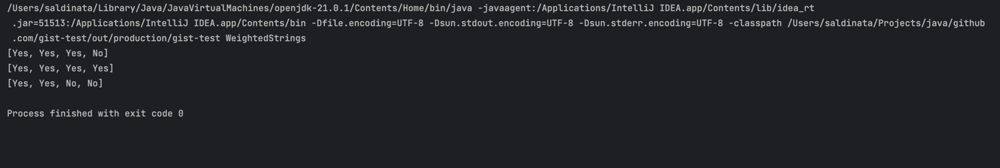
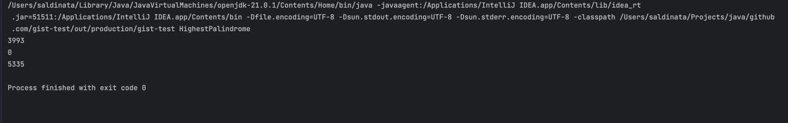
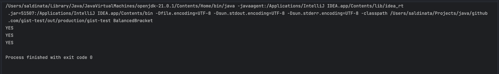

## Screenshot
1. Screenshot WeightedStrings : 



2. Screenshot HighestPalindrome :


   
3. Screenshot BalancedBracket :


   

## Complexity
Here's a detailed breakdown of the time and space complexity of each line of the revised Java code for checking balanced brackets:

```java
    Stack<Character> stack = new Stack<>();
```

Time complexity: 
- O(1) - Creating a new Stack object is a constant-time operation.

Space complexity: 
- O(1) - Initializing an empty Stack takes constant memory.

```java
    HashMap<Character, Character> bracketPairs = new HashMap<>();
```

Time complexity: 
- O(1) - Creating a new HashMap object is a constant-time operation.

Space complexity: 
- O(1) - Initializing an empty HashMap takes constant memory.

```java
    bracketPairs.put('(', ')');
```

Time complexity: 
- O(1) - Inserting a key-value pair into a HashMap is a constant-time operation.

Space complexity: 
- O(1) - Adding an element to the HashMap increases its memory usage by a constant amount.

```java
    bracketPairs.put('{', '}'); 
```

Time complexity: 
- O(1) - Inserting a key-value pair into a HashMap is a constant-time operation.

Space complexity: 
- O(1) - Adding an element to the HashMap increases its memory usage by a constant amount.

```java
    bracketPairs.put('[', ']');
```

Time complexity: 
- O(1) - Inserting a key-value pair into a HashMap is a constant-time operation.

Space complexity: 
- O(1) - Adding an element to the HashMap increases its memory usage by a constant amount.

```java
    for (int i = 0; i < expression.length(); i++)
```

Time complexity: 
- O(n) - The 'for' loop iterates n times, where n is the length of the input string.

Space complexity: 
- O(1) - The loop's control variable 'i' occupies constant memory.

```java
    char c = expression.charAt(i);
```
Time complexity: 
- O(1) - Accessing a character by index in a string is a constant-time operation.

Space complexity: 
- O(1) - The variable 'c' occupies constant memory.

```java
    if (bracketPairs.containsKey(c))
```
Time complexity: 
- O(1) - Checking for a key in a HashMap is a constant-time operation.

Space complexity: 
- O(1) - Comparing 'c' against the HashMap's keys takes constant memory.

```java
    stack.push(c);
```
Time complexity: 
- O(1) - Pushing an element onto the Stack is a constant-time operation.

Space complexity: 
- O(1) - Adding an element to the Stack increases its memory usage by a constant amount.

```java 
    else if (!stack.isEmpty() && bracketPairs.get(stack.peek()) == c)
```
Time complexity: 
- O(1) - Checking if the stack is empty is a constant-time operation.
- O(1) - Accessing the top element of the Stack is a constant-time operation.
- O(1) - Checking for a value in a HashMap is a constant-time operation.

Space complexity: 
- O(1) - Checking stack emptiness, accessing the top element, and comparing 'c' take constant memory.

```java
    stack.pop();
```
Time complexity: 
- O(1) - Popping an element from the Stack is a constant-time operation.

Space complexity:
- O(1) - Removing an element from the Stack decreases its memory usage by a constant amount.

```java
    else if (c == ',')
```
Time complexity: 
- O(1) - Checking for a single character equality is a constant-time operation.

Space complexity: 
- O(1) - Comparing 'c' to the comma character takes constant memory.

```java
    continue;
```
Time complexity: 
- O(1) - The 'continue' statement skips the remaining instructions and jumps back to the loop condition.

Space complexity: 
- O(1) - The 'continue' statement itself doesn't affect space usage.

```java
    else if (Character.isWhitespace(c))
```
Time complexity: 
- O(1) - Checking if a character is whitespace is a constant-time operation.

Space complexity: 
- O(1) - Comparing 'c' to whitespace characters takes constant memory.

```java
    continue;
```
Time complexity: 
- O(1) - The 'continue' statement skips the remaining instructions and jumps back to the loop condition.

Space complexity: 
- O(1)
